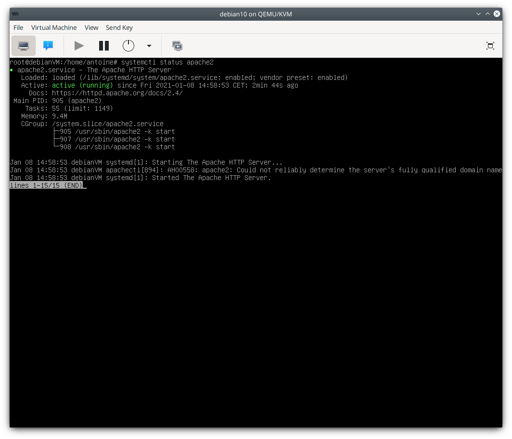
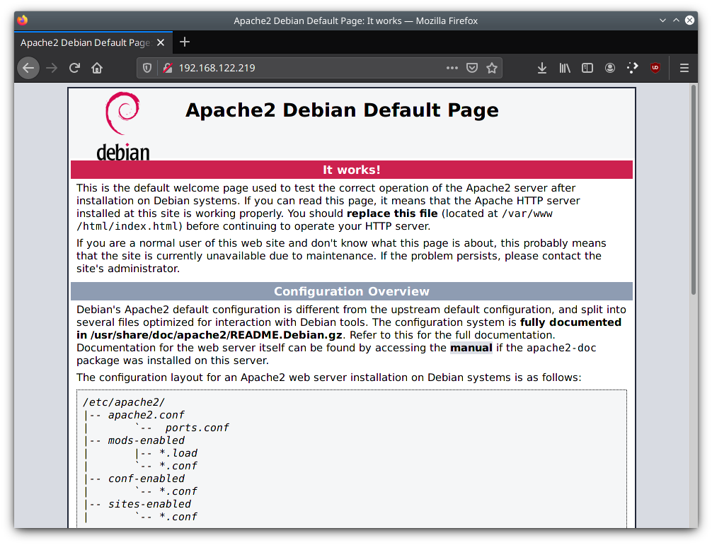
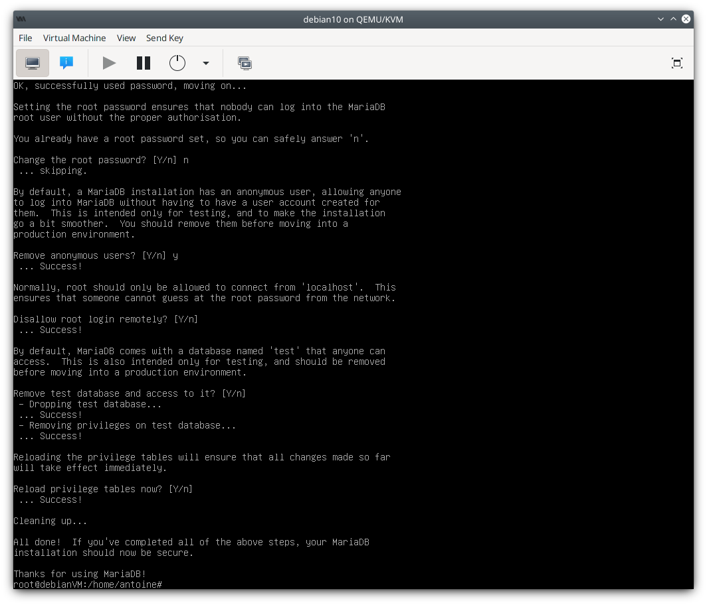
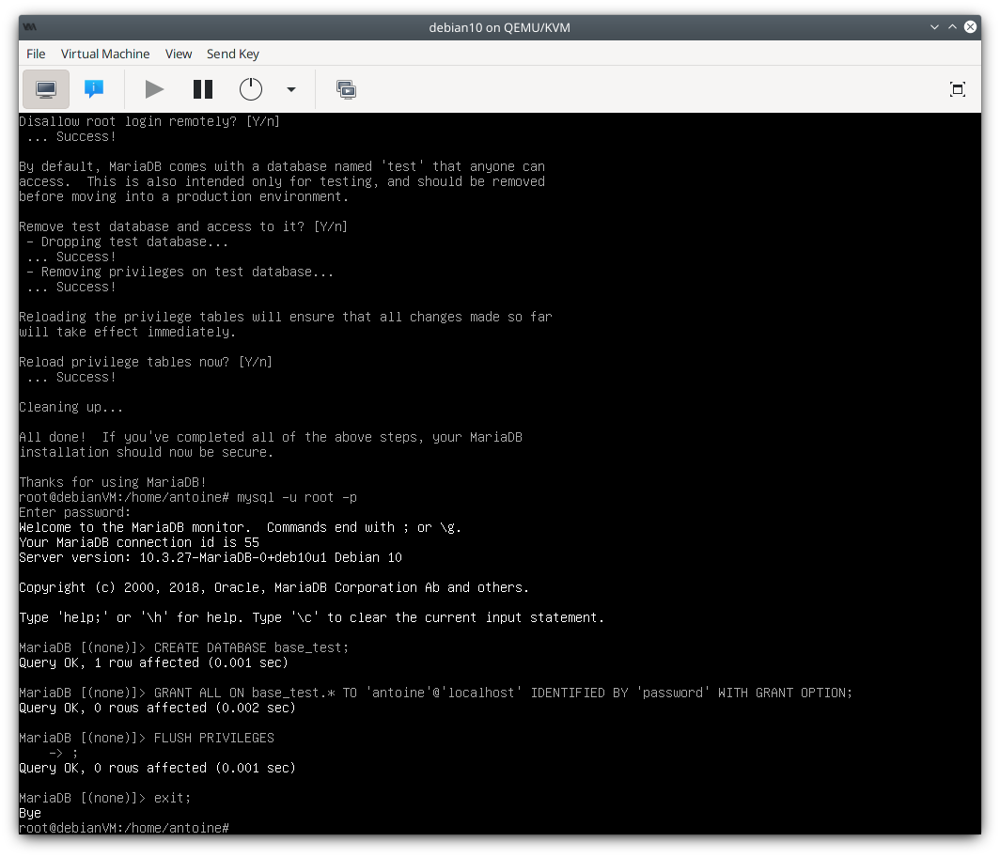
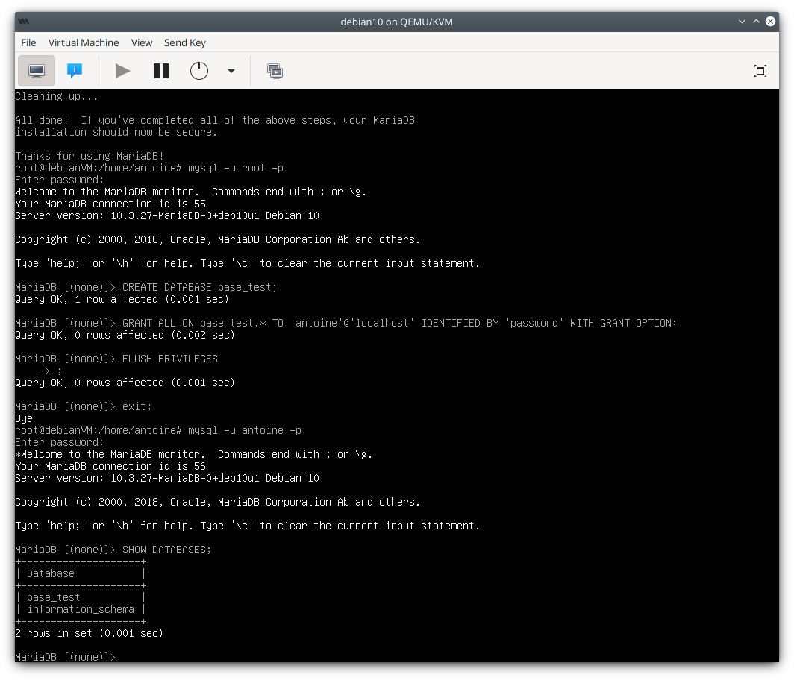
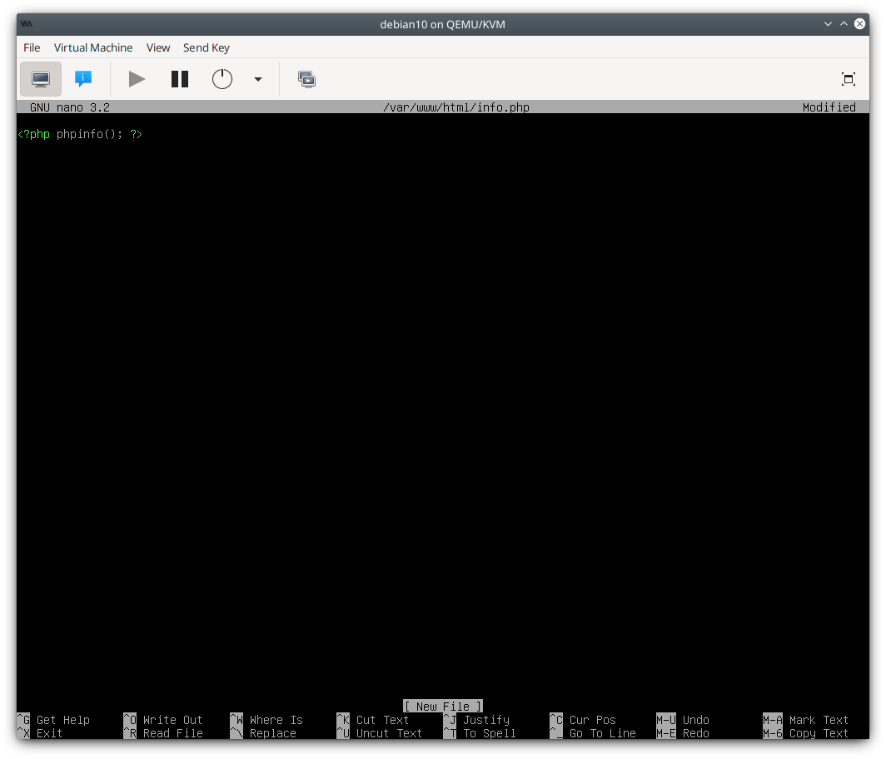
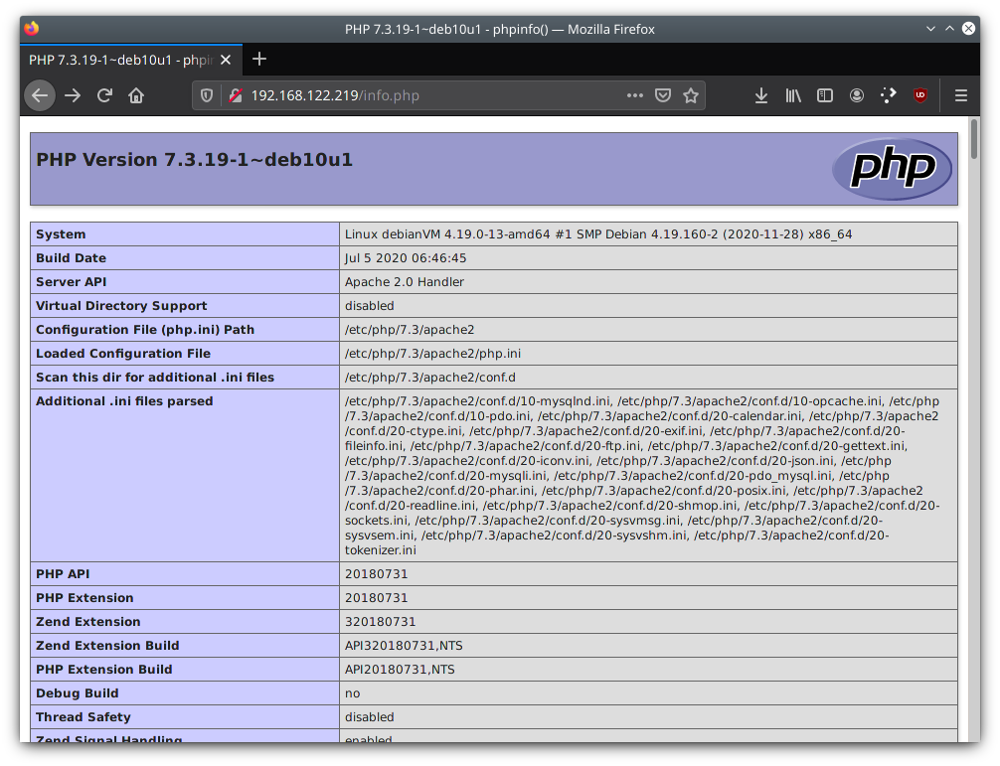

# Installation d'un serveur LAMP Debian

- [Installation d'un serveur LAMP Debian](#installation-dun-serveur-lamp-debian)
  - [Installer Apache 2](#installer-apache-2)
  - [Virtual Hosts](#virtual-hosts)
    - [Trouver des IP et une interface disponible](#trouver-des-ip-et-une-interface-disponible)
    - [Configurer les zones virtuelles](#configurer-les-zones-virtuelles)
  - [Installer MariaDB](#installer-mariadb)
  - [Installer PHP](#installer-php)
  - [Tester PHP sur Apache](#tester-php-sur-apache)


## Installer Apache 2
`# apt install apache2`

Vérifier si le service Apache est en train de tourner:  
`# systemctl status apache2`


Sur un navigateur web, essayer de charger la page en utilisant l'IP du serveur.


Les fichiers de configuration se trouvent sous `/etc/apache2/`  
`apache2.conf` : config générale  
`ports.conf` : port d'écoute  

La page web se trouve sous `/var/www/html/`

## Virtual Hosts
Pour avoir plusieurs sites sur la même machine, nous aurons besoin de créer des virtualhosts. Il nous faudra utiliser des IP différentes pour chaque arborescence de site.

### Trouver des IP et une interface disponible


Pinger les IP qui nous intéressent. Si il n'y a pas de réponse, on peut assumer que l'IP est libre pour nous.

`ip a` pour trouver notre interface réseau

Pour ajouter une IP sur une interface en créant une sous interface:
`ip addr add IP dev INTERFACE label INTERFACE:X`
Cette IP dure jusqu'au prochain reboot
Si on souhaitait avoir des IP persistantes, il faudrait modifier directement le fichier de config `/etc/network/interfaces.d`

À ce moment on devrait avoir exactement la même page sur la première et seconde IP

### Configurer les zones virtuelles
`cd/etc/apache2/sites-available/`
`ls -l`

`Le fichier 000-default.conf` décrit la donfiguration virtual host par défaut.

Nous allons créer un nouveau fichier qui contiendra notre configuration:
`touch ip_vhosts.conf`
`nano ip_vhosts.conf`

```
<VirtualHost 192.168.122.219:80>
  ServerAdmin web@antoniobiscuit.fr
  DocumentRoot "/var/www/vhosts/site1"
  ServerName site1.antoniobiscuit.fr
  ErrorLog "/var/log/apache2/site1_error_log"
  CustomLog "/var/log/apache2/site1_access_log" combined
</VirtualHost>

<VirtualHost 192.168.122.220:80>
  ServerAdmin web@antoniobiscuit.fr
  DocumentRoot "/var/www/vhosts/site2"
  ServerName site2.antoniobiscuit.fr
  ErrorLog "/var/log/apache2/site2_error_log"
  CustomLog "/var/log/apache2/site2_access_log" combined
</VirtualHost>
```

## Installer MariaDB

`# apt install mariadb-server`

Pour s'assurer de la sécurité:  
`# mysql_secure_installation`


Créer un utilisateur et une base de données:
Se connecter à mysql en tant que root:  
`# mysql -u root -p`

    MariaDB [(none)]> CREATE DATABASE base_test;
    MariaDB [(none)]> GRANT ALL ON base_test.* TO 'antoine'@'localhost' IDENTIFIED BY 'password' WITH GRANT OPTION;
    MariaDB [(none)]> FLUSH PRIVILEGES;
    MariaDB [(none)]> exit;


Véfier si l'utilisateur peut se logger et voir la base de données:

    # mysql -u antoine -p
    MariaDB [(none)]> SHOW DATABASES;


## Installer PHP

`# apt install php libapache2-mod-php php-mysql`

Redémarrer Apache:  
`# systemctl reload apache2`  
`# systemctl status apache2`


## Tester PHP sur Apache

`# nano /var/www/html/info.php`


Charger la page sur un navigateur:  
`http://SERVER_IP/info.php`


Enfin, supprimer le fichier par sécurité:  
`# rm /var/www/html/info.php`